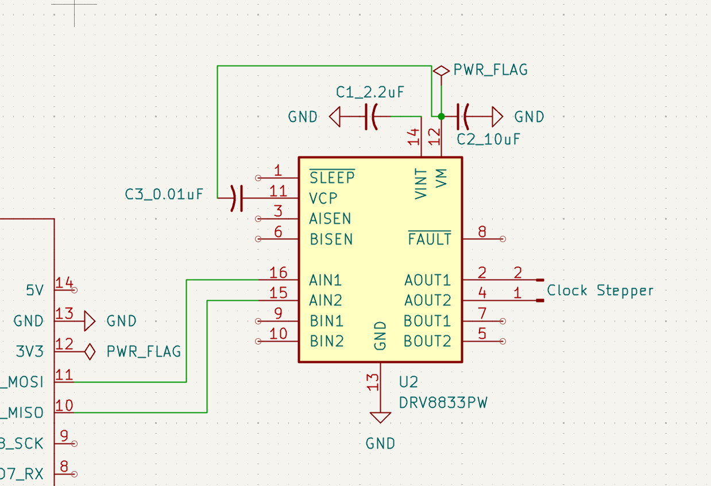

#### 8/20/2025
Moving to a DRV8833 motor controller bc it has negligible on-board voltage drop, so I can pipe in 3.7 and get out about 3.7, which is what I need for the Lavet-type stepper motor.
Lavet steppers use 1.5 or 3 volts. This article is helpful: [article](https://www.codrey.com/electronics/lavet-type-stepping-motor-quartz-clock-engine-hacks/)s

*60min* learned how capacitors work to set up my motor controller. this [Reddit post](https://www.reddit.com/r/AskElectronics/comments/bwxk9m/how_does_a_bypass_capacitor_work_and_what_does_it/) explained the bypass capacitors are just capacitors functioning as bypasses for AC noise on the circuit - caps store DC and pass AC, so it keeps the circuit at a useful operating voltage.
