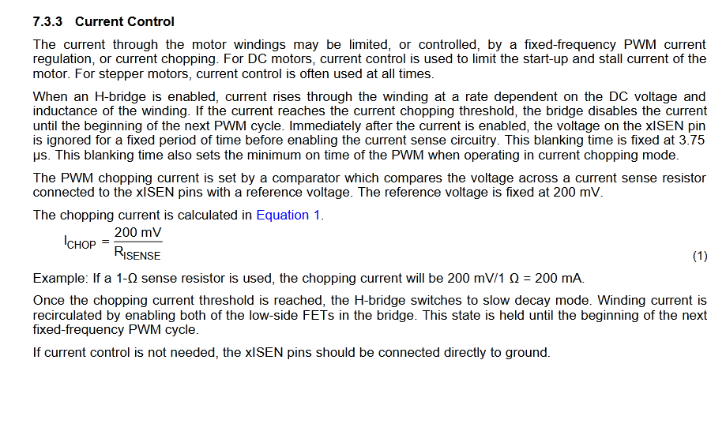
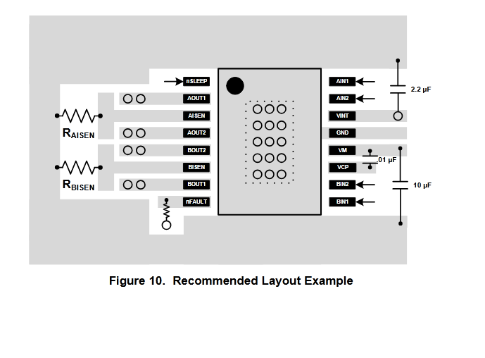
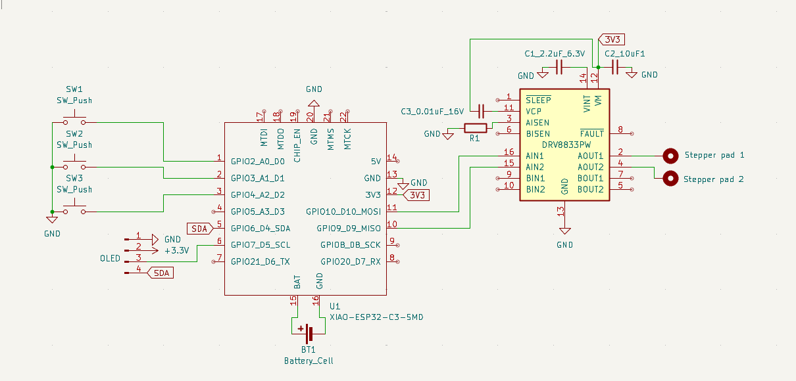

#### Ye olde days

I want to hack a clock motor bit that's laying around.

Found this article with a clock controller: 

[RasberryPiMag-AnalogClockController.pdf](Assets/PiProjectScreenshot.png)

It looks like they’re just running 10 mA pulses using a motor controller. I bet I could wire directly from a board that has better pins.

Motor driver specs: https://potentiallabs.com/cart/l293d-ic

Then the output is turned down with a 470 ohm resistor

*4h* I built out a schematic based off his article:
[first version of the schematic](Assets/SchematicV1.png)

#### 8/20/2025
Moving to a DRV8833 motor controller bc it has negligible on-board voltage drop, so I can pipe in 3.7 and get out about 3.7, which is what I need for the Lavet-type stepper motor.
Lavet steppers use 1.5 or 3 volts. This article is helpful: [article](https://www.codrey.com/electronics/lavet-type-stepping-motor-quartz-clock-engine-hacks/)s

*60min* learned how capacitors work to set up my motor controller. this [Reddit post](https://www.reddit.com/r/AskElectronics/comments/bwxk9m/how_does_a_bypass_capacitor_work_and_what_does_it/) explained the bypass capacitors are just capacitors functioning as bypasses for AC noise on the circuit - caps store DC and pass AC, so it keeps the circuit at a useful operating voltage.

#### 8/30/2025 
*2h* I need ceramic capacitors bc they filter noise better than electrolytic
The VCP is how the mosfet turns on, and the capacitor is there to boost voltage (vcp voltage has to be higher than VIM)

not really sure what the VINT is there for

VCP needs a bootstrap circuit that I don't know how to make (yet).

I might need a resistor at AISEN to limit current: 

Thick trace from VM to ground

There's no resistor on the high-side pin? 

#### 8/31/2025
*1h*

ok so VCP is a flying capacitor - the charge pump circuit is inside the chip.

I added the resistor to AISEN, which is ground for the A circuit.

Pretty confident this schematic will work going forward: 