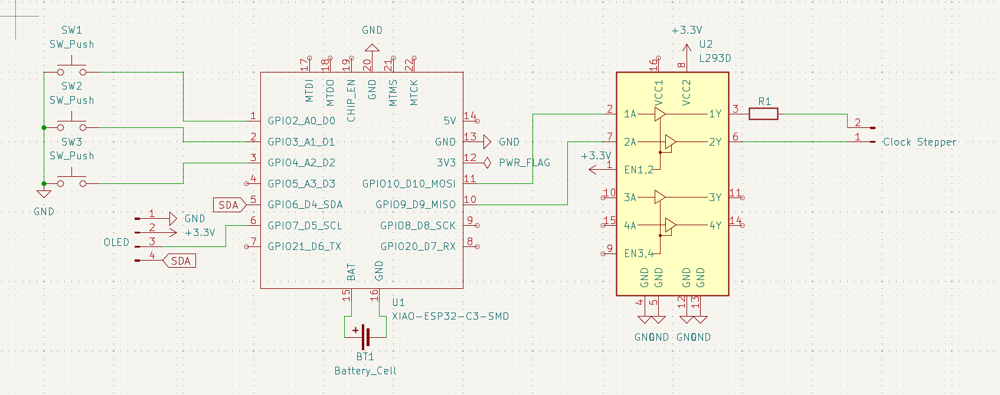
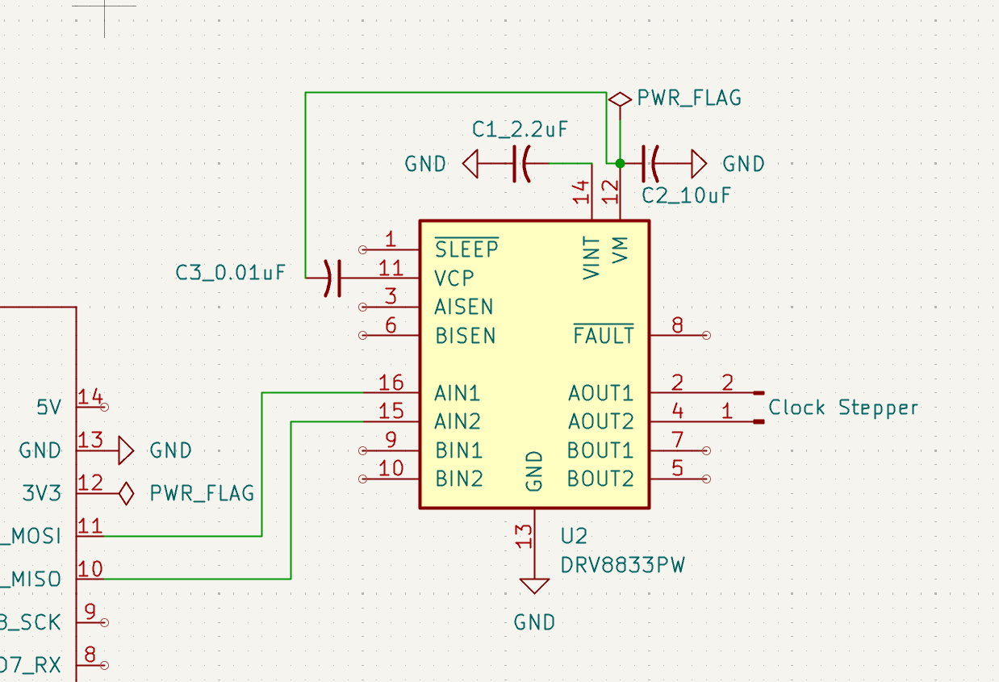
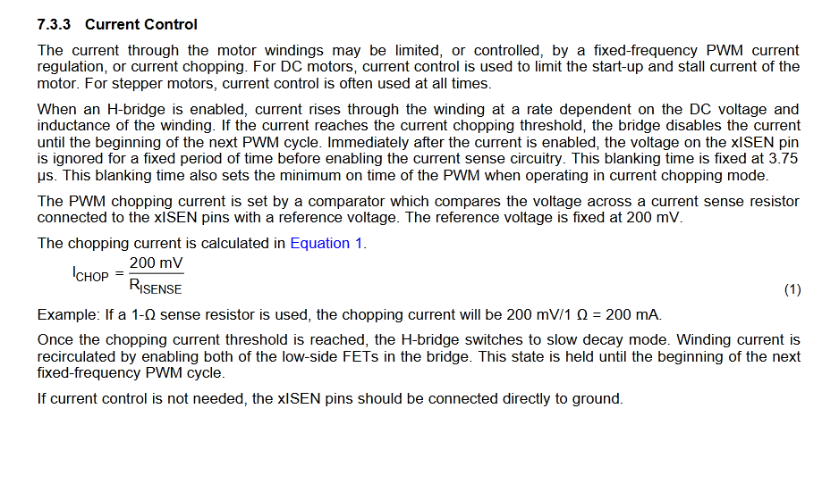
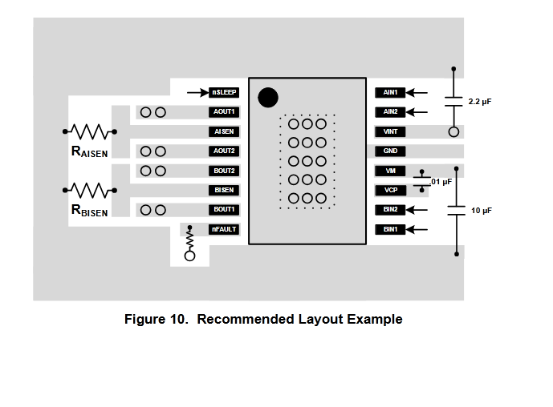
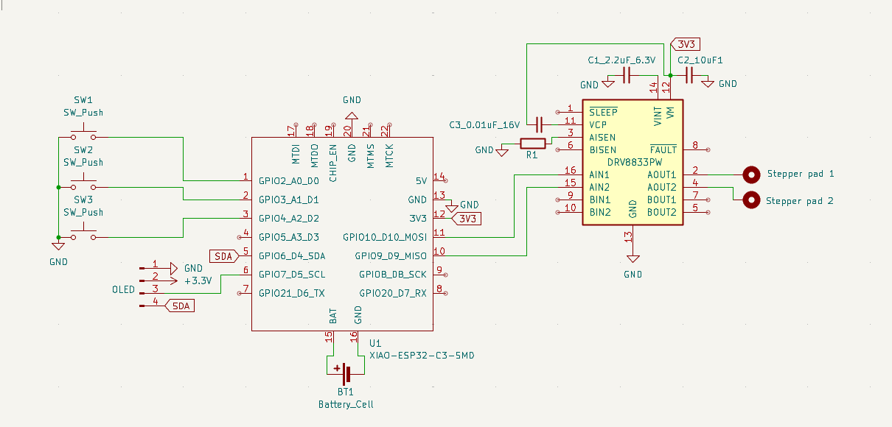
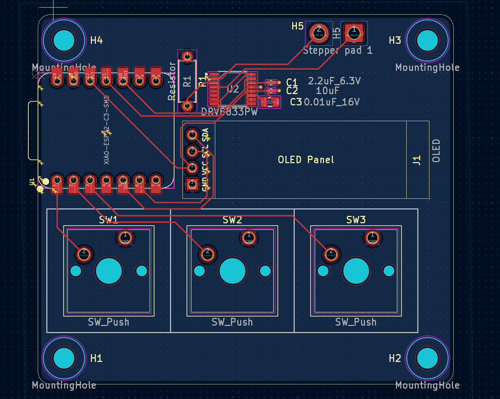
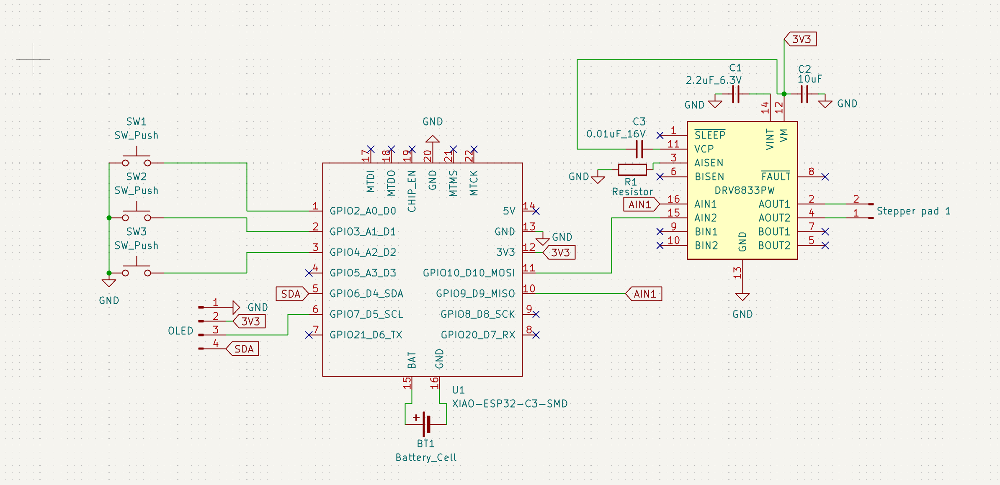

#### 7_9_2025

*30m* Begin!
I have a clock motor laying around (for an analog mounted wall clock). The ideas is hacking it to do whatever I want. Mode 1 is regular clock. Then, if you press start, it runs like a watch chronometer.

Found this article with a clock controller: 

[RasberryPiMag-AnalogClockController.pdf](Assets/PiProjectScreenshot.png)

It looks like they’re just running 10 mA pulses using a motor controller. I bet I could wire directly from a board that has better pins.

Motor driver specs: https://potentiallabs.com/cart/l293d-ic

Then the output is turned down with a 470 ohm resistor

#### 7_12_2025 

*45m* Sketch the schematic
Motor controllers are weird. The wiring diagram I'm going off had several extra traces I don't need (they're for an extra switch he was using). Once I figured that out, I read some articles about H-bridges to figure out the motor controller and drew the traces.

The switches are a one-row matrix to save space.

*30m* Read the ESP32-C3 datasheet.
The datasheet said the ESP32-C3 didn't have an internal clock, so I asked on the Slack. @luteron6 helped out - I was reading the schematic for the chip itself and not the module. Since the module has a clock, I can continue on.

#### 7_13_2025

*1.5h* Make the schematic.
Learned a couple helpful things. Headers are called Conn pins, and that's what I used for the OLED and clock input.

*1h* Motor controller swap
I was putting off figuring out how to jump from the 3V3 to the 5V for the L293D. I *could* add some components to raise the voltage. But since the clock stepper is a Lavet-type stepper motor, it likely draws 1.5 volts, so raising, then lowering, the voltage isn't useful. Instead I'm going to use the ChatGPT recommended DRV8833 which operates down to 2.7V due to the MOSFET.

#### 8/20/2025
*30m* Moving to a DRV8833 motor controller bc it has negligible on-board voltage drop, so I can pipe in 3.7 and get out about 3.7, which is what I need for the Lavet-type stepper motor.
Lavet steppers use 1.5 or 3 volts. This article is helpful: [article](https://www.codrey.com/electronics/lavet-type-stepping-motor-quartz-clock-engine-hacks/)s

*60m* learned how capacitors work to set up my motor controller. this [Reddit post](https://www.reddit.com/r/AskElectronics/comments/bwxk9m/how_does_a_bypass_capacitor_work_and_what_does_it/) explained the bypass capacitors are just capacitors functioning as bypasses for AC noise on the circuit - caps store DC and pass AC, so it keeps the circuit at a useful operating voltage.

#### 8/30/2025 
*2h* I need ceramic capacitors bc they filter noise better than electrolytic
The VCP is how the mosfet turns on, and the capacitor is there to boost voltage (vcp voltage has to be higher than VIM)

not really sure what the VINT is there for

VCP needs a bootstrap circuit that I don't know how to make (yet).

I might need a resistor at AISEN to limit current: 

Thick trace from VM to ground

There's no resistor on the high-side pin? 

#### 8/31/2025
*1h*

ok so VCP is a flying capacitor - the charge pump circuit is inside the chip.

I added the resistor to AISEN, which is ground for the A circuit.

Pretty confident this schematic will work going forward: 

Goals:
  1. make a pcb with roundy corners bc I like
  2. find that article with all the good tips on schematics in the secret hackclub docs

#### 9/9/2025

*1h* Sooo looks like I've been keeping two journals by accident. I moved all of the new journal to this journal. Anyway, today I figure out what footprints to use for the capacitors (they come in just a few standards). I also learned that for schematics you need a _reference designator_ (R1) and a _value field_ (5 ohms). So I fixed that on the cad.

My capacitors are attached to the ground plane with a few vias, because they're surface mounted on the opposite side.

This is the current PCB design:

And this is my schematic:

I got trained at the innovation lab so I can use their soldering irons now.